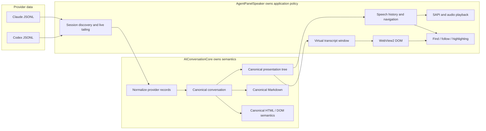

# AgentPanelSpeaker + AIConversationCore architecture review

This directory is the visual design map for PR #15 (`feature/aiconversationcore-integration`).
It is intended to make the integration reviewable by architecture and behavior rather than by reading every changed file.

## What the 87 changed files represent

The PR's 87 changed paths are the complete diff between `main` and `feature/aiconversationcore-integration`; they are not 87 equally important hand-written design changes.

| Group | Files | What it means |
| --- | ---: | --- |
| AgentPanelSpeaker source and regression tests | 41 | Application integration, transcript, speech, settings, and test harnesses |
| Bundled `AIConversationCore` runtime | 34 | Pinned runtime copy shipped beside the app, including `marked`; mostly packaging/runtime material |
| Repository docs/config | 6 | `DESIGN.md`, README/install/notices, `.gitmodules`, `run.cmd` |
| Display-parity tool | 2 | Separate validation executable |
| Other tools | 2 | Node bridge worker and parity classification data |
| CI workflow | 1 | Integration validation |
| AIConversationCore submodule pointer | 1 | Development/source pin |
| **Total** | **87** | |

A newly added file appears in GitHub as an entire file because there is no version on `main` to diff against. That does not mean every such file represents a separate architectural concept.

## Read these diagrams first

1. [Current runtime architecture](current-runtime.md) — what PR #15 does today, including transitional duplication that still needs removal.
2. [Target Core boundary](target-core-boundary.md) — the intended parse-once/project-many architecture and ownership rules.
3. [Transcript, virtualization, speech, and identity](transcript-and-speech.md) — how canonical IDs, DOM mapping, virtual windows, search, speech, and highlighting fit together.

## Design boundary in one picture

### Hard rule

Once provider data has been normalized into Core, AgentPanelSpeaker must not reinterpret provider-specific semantics. Core owns semantic normalization and the canonical Markdown/HTML presentation paths. AgentPanelSpeaker owns application behavior around those semantics: session selection, live tailing, speech policy, navigation, virtualization, WebView2 transport, and highlighting.

## Current versus target

The current branch has substantially moved toward that boundary, but it still contains duplicate projection paths:

- `CanonicalSessionExtractor` retains raw JSONL lines and currently calls `AIConversationCoreClient.Project(...)` with the complete line set again on each append.
- `TranscriptPresentationDomFormatter` owns a separate static Core client and projects the complete file independently for transcript DOM construction.
- `TranscriptNodeIdentityMap` creates another Core client and independently projects the complete file to reconstruct speech/display identities.

Those are explicitly **transitional**, not the target design. AgentPanelSpeaker #35 and AIConversationCore #76 track replacing them with one retained canonical session and cheap projection/visibility changes.

## Review questions

When reviewing the integration, concentrate on these questions:

- Does provider-specific meaning exist only in AIConversationCore?
- Is there one canonical identity namespace shared by display, speech, search, and highlighting?
- Can presentation settings change without reparsing provider history?
- Does live append process only new source records rather than the unchanged prefix?
- Can WebView virtualization unload DOM without changing canonical identity?
- Can the speech cursor move/cancel/resume without rebuilding history or remapping IDs?
- Are expensive diagnostics and compatibility paths clearly separated from normal runtime behavior?

## Related work

- AgentPanelSpeaker.NET #19 — structural DOM parse stability / diagnostics cleanup.
- AgentPanelSpeaker.NET #31 — spoken Markdown emphasis delimiters.
- AgentPanelSpeaker.NET #33 — automate production-path smoke/acceptance testing.
- AgentPanelSpeaker.NET #35 — retained-session rollback visibility, virtualization, and speech behavior.
- AIConversationCore #76 — normalize full Codex revision history once and project visibility afterward.
