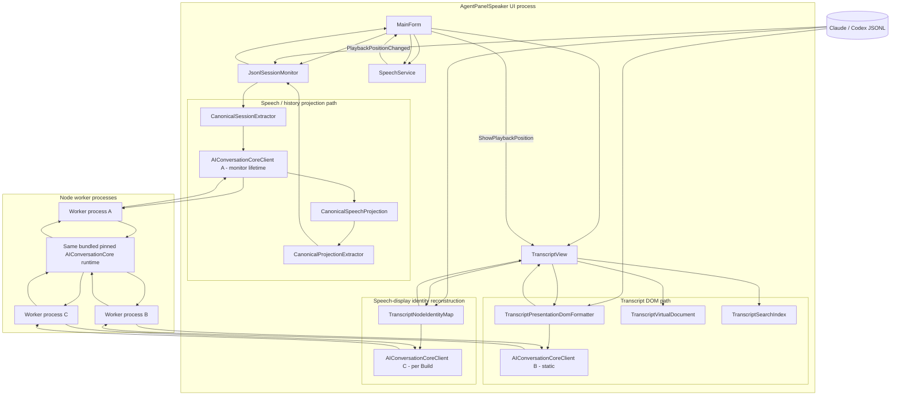
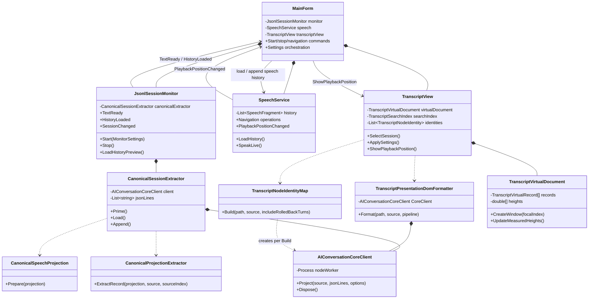
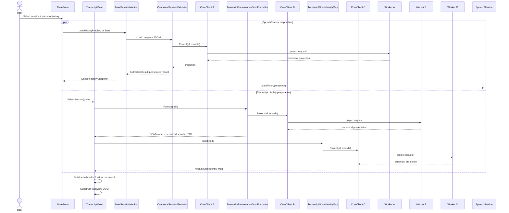
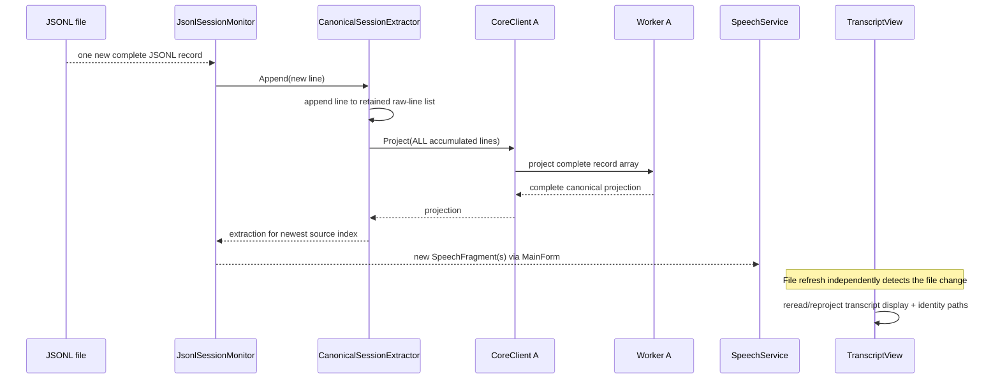

# Current runtime architecture

This document describes the **current** `feature/aiconversationcore-integration` branch. It deliberately shows transitional duplication so it is not mistaken for the intended final architecture.

## Runtime component diagram

Each `AIConversationCoreClient` owns its own Node process. The clients all load the same pinned bundled Core runtime, but they are **not** one shared worker process.

### What is good here

- Provider semantics are obtained from AIConversationCore rather than from a parallel Claude/Codex semantic parser in the app.
- Each `AIConversationCoreClient` keeps its own Node bridge process alive for the lifetime of that client and validates the pinned Core commit.
- `CanonicalProjectionExtractor` maps canonical events into app-owned speech/navigation structures rather than examining provider-native rollback/tool/message shapes.
- WebView playback positions carry the same app node IDs used by speech history.

### What is transitional / wrong for the final design

The branch currently has **multiple Core clients/projection entry points**:

1. `CanonicalSessionExtractor` owns a client for monitor/speech extraction.
2. `TranscriptPresentationDomFormatter` owns another static client for the transcript DOM.
3. `TranscriptNodeIdentityMap.Build()` creates another client for identity reconstruction.

Keeping each worker alive solved repeated **process startup within that client lifetime**, but `CanonicalSessionExtractor.Append()` still stores every valid JSONL line and calls `Project()` on the complete accumulated line set. The display and identity paths also reread/reproject the complete file independently.

That means the current implementation does not yet satisfy **parse once, project many**.

## Current class/dependency view

## Initial-load sequence today

The three projection calls are the central architectural problem addressed by AgentPanelSpeaker #35 / AIConversationCore #76.

## Live append sequence today

The app currently avoids republishing old speech fragments, but Core still processes the unchanged prefix again. The target architecture removes that distinction by retaining canonical session state itself.

## Important source files

- `AgentPanelSpeaker/MainForm.cs` — top-level UI/application orchestration.
- `AgentPanelSpeaker/JsonlSessionMonitor.cs` — session selection, initial history, file tailing, duplicate suppression.
- `AgentPanelSpeaker/CanonicalSessionExtractor.cs` — current accumulated-record Core projection seam.
- `AgentPanelSpeaker/AIConversationCoreClient.cs` — Node process transport and Core contract validation; one process per client instance.
- `tools/AIConversationCore-worker.mjs` — Node bridge into the bundled Core runtime.
- `AgentPanelSpeaker/CanonicalProjectionExtractor.cs` — canonical events -> app-owned speech/timing data.
- `AgentPanelSpeaker/TranscriptPresentationDomFormatter.cs` — current Core presentation tree -> DOM-object model.
- `AgentPanelSpeaker/TranscriptNodeIdentityMap.cs` — current independent identity reconstruction.
- `AgentPanelSpeaker/TranscriptVirtualDocument.cs` — virtualized transcript structural units and spacer accounting.
- `AgentPanelSpeaker/SpeechService.cs` — retained navigation history, playback state, cancellation/restart, live-end behavior.
