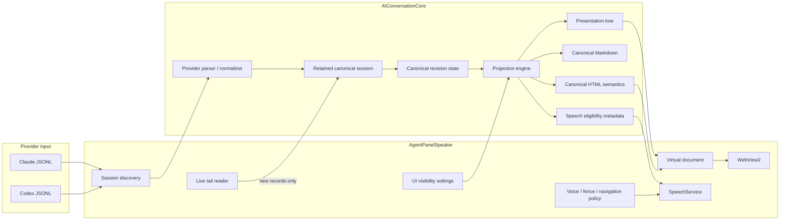
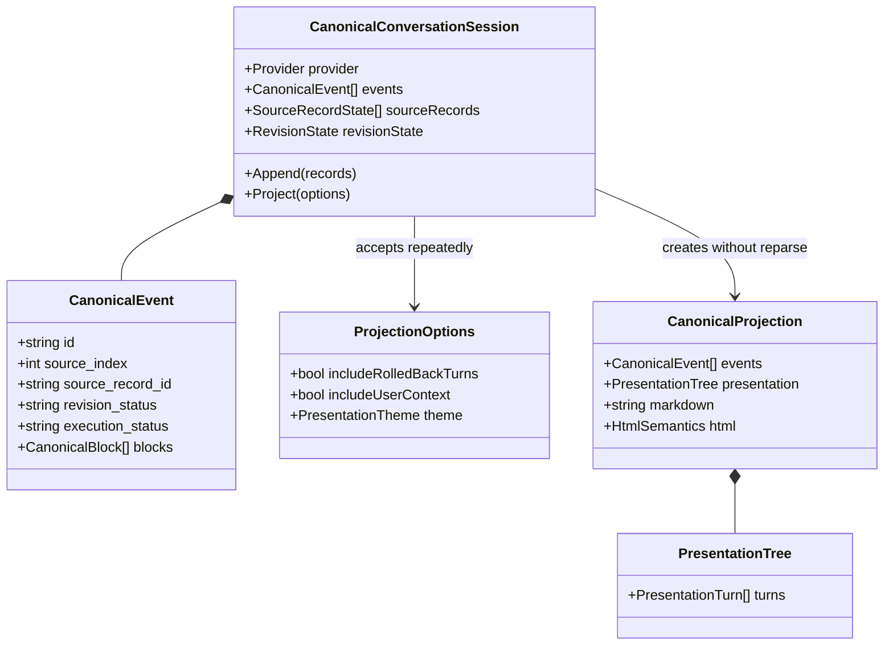
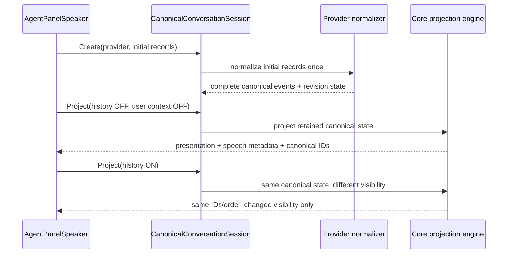
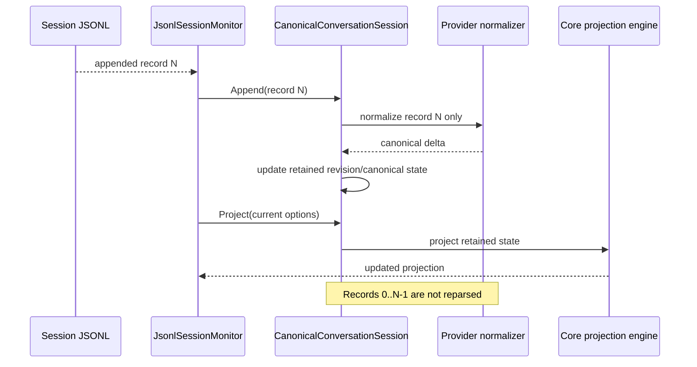
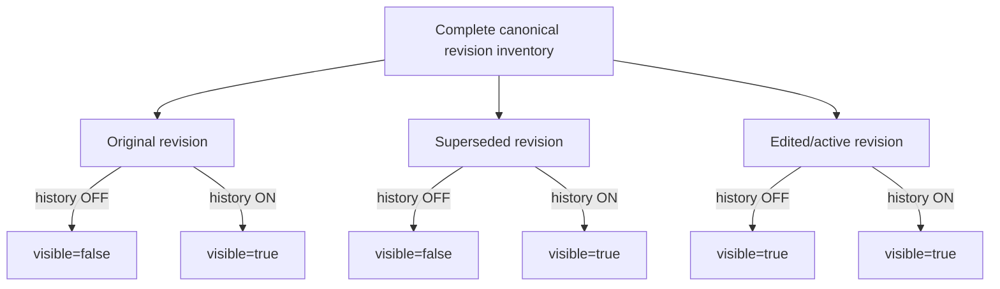
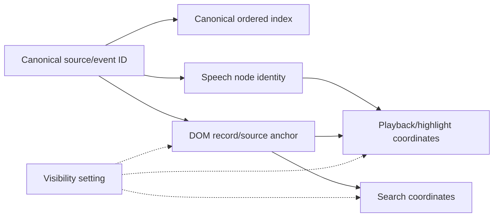

# Target Core boundary: parse once, project many

This document is the **target** architecture tracked by AgentPanelSpeaker.NET #35 and AIConversationCore #76. It is not a claim that PR #15 already implements every part shown here.

## Ownership model



### Ownership rules

**Core owns:**

- provider-native parsing and normalization;
- rollback/edit/superseded/aborted semantics;
- complete canonical source/event identity;
- canonical presentation structure;
- semantic Markdown and HTML rendering;
- provider-derived speech eligibility facts such as User/IDE context identity.

**AgentPanelSpeaker owns:**

- locating and following files;
- deciding when a newly appended source record is available;
- user settings and application presentation policy;
- virtual-window materialization;
- WebView2 transport and DOM lifecycle;
- speech voice/profile/fence policy;
- navigation, pause/resume, audio playback, and highlight behavior.

AgentPanelSpeaker may filter or present canonical facts. It must not rediscover what a provider record *means*.

## Retained session object



The central invariant is that `Project(options)` changes presentation/eligibility metadata but **does not create a new canonical identity namespace**.

## Initial load



## Live append



Rollback records can modify the **status** of earlier canonical events, but their IDs and source indexes remain stable.

## Rolled-back history visibility



The setting changes a visibility/eligibility projection. It does **not** remove historical events from the canonical inventory and must not cause a provider reparse.

## Display implementation

Core should expose revision status on canonical presentation nodes. AgentPanelSpeaker can map that to stable DOM attributes/classes:

```html
<section
  class="transcript-turn revision-superseded"
  data-revision-status="superseded"
  data-canonical-id="...">
```

The checkbox then changes root presentation state or a visibility mask. For already materialized DOM, CSS can show/hide the same nodes. For nodes outside the virtual window, the same visibility mask guides window materialization.

## Why identity must not depend on visibility



`Visibility setting` influences eligibility/presentation but **never feeds back into ID generation**.

## Setting change while speaking historical content

When `Show rolled-back Codex history` changes from ON to OFF:

```mermaid
sequenceDiagram
  actor User
  participant UI as Transcript settings
  participant Core as Retained Core session
  participant Speech as SpeechService
  participant DOM as TranscriptView/WebView

  User->>UI: uncheck Show rolled-back history
  UI->>Core: Project(history OFF)
  Core-->>UI: same canonical IDs, historical units now hidden
  UI->>DOM: apply visibility mask

  alt current speech unit remains visible
    UI->>Speech: eligibility changed; current index still valid
    Speech-->>Speech: continue normally
  else current speech unit is now hidden
    UI->>Speech: hide current historical unit
    Speech->>Speech: cancel current utterance
    Speech->>Speech: find next visible eligible canonical unit
    Speech->>DOM: move marker to destination
    Speech->>Speech: apply normal inter-fragment pause
    Speech->>Speech: resume automatically
  end
```

If paused on a historical unit, move directly to the next visible eligible unit; do not preserve a hidden paused cursor. If no visible eligible unit follows, enter the appropriate paused/live-end state.

## Cross-repository responsibility

AIConversationCore #76 must provide the retained canonical session/project-many semantics first. AgentPanelSpeaker #35 should consume that API rather than implementing its own provider-aware rollback cache.
