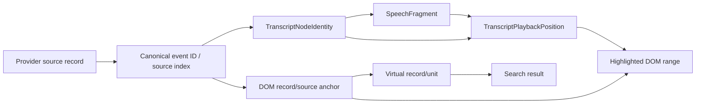
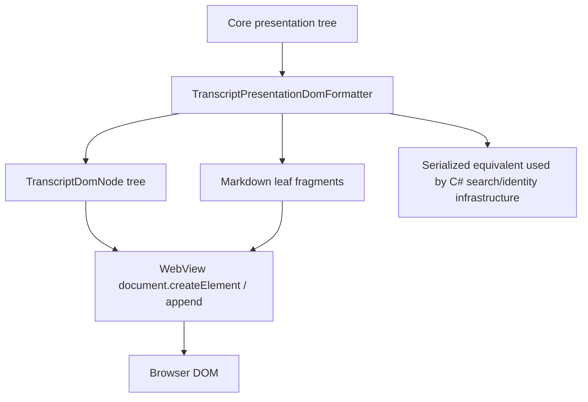
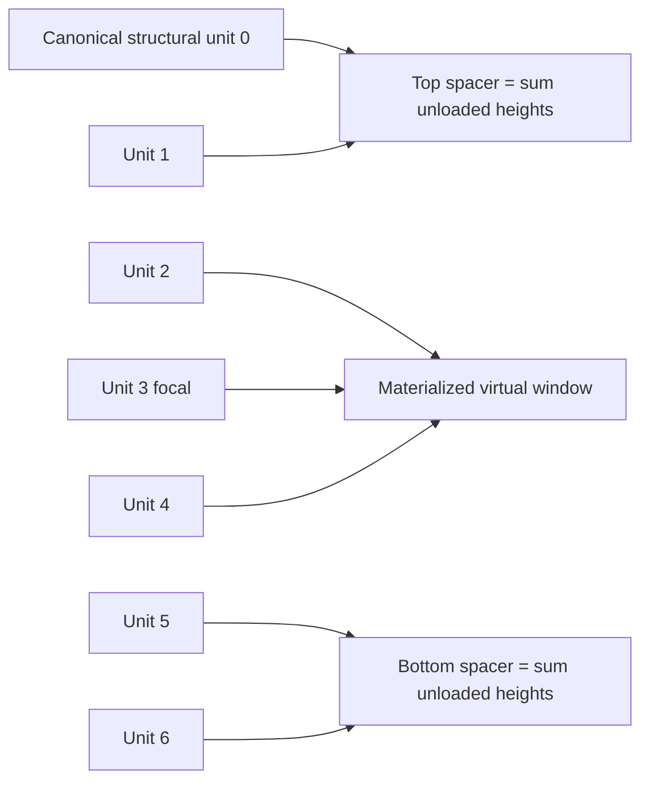
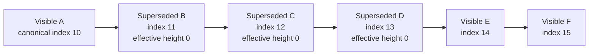
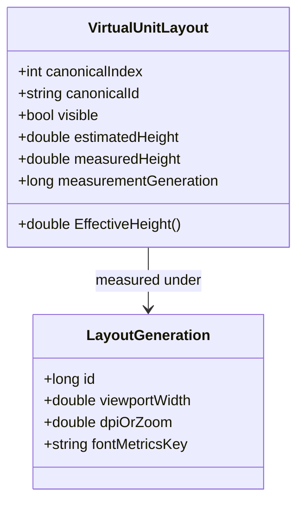
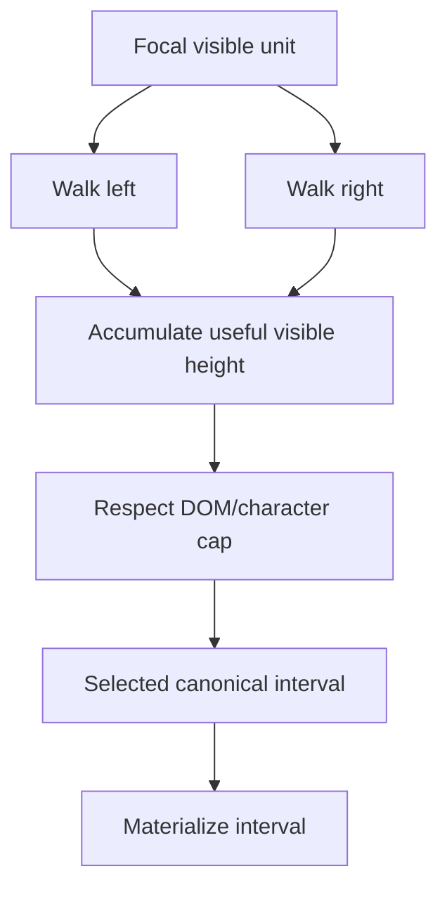
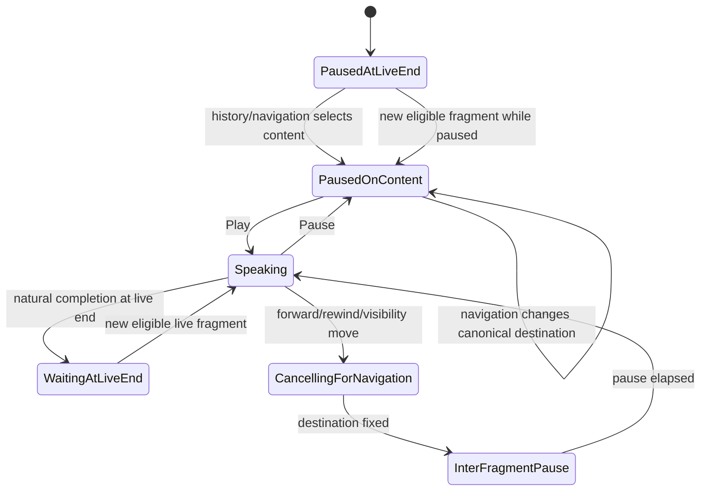
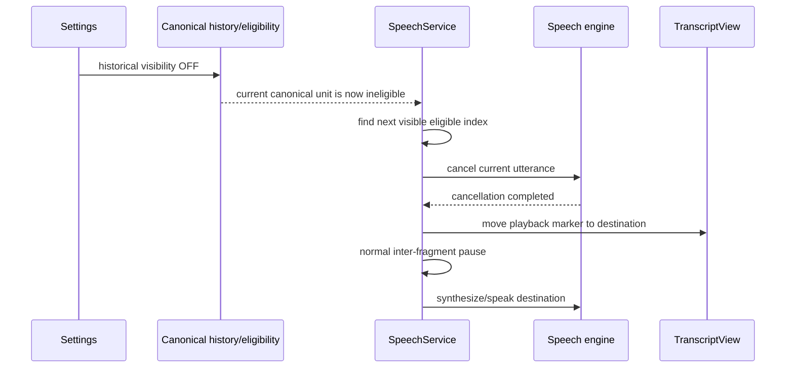
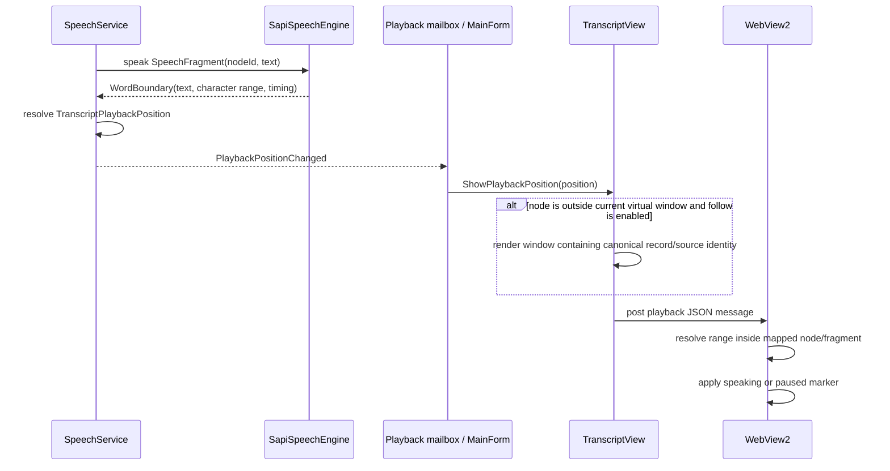
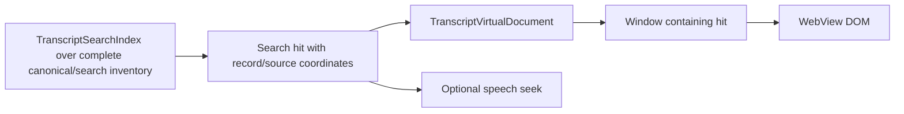

# Transcript virtualization, identity, speech, and highlighting

This document concentrates on the runtime area most likely to produce subtle regressions: the relationship between canonical identity, virtualized DOM, speech navigation, and the playback highlight.

## One identity namespace



The same canonical provenance must connect the speech fragment and DOM anchor. Text matching is allowed only inside that already-established identity scope; text itself is not the global identity.

## Structural presentation path



Structural elements such as turns, reasoning disclosures, tools, and User Context are created as DOM objects rather than by splitting one large HTML string and repeatedly assigning `innerHTML`. Markdown parsing is restricted to leaf content.

## Virtual document today

`TranscriptVirtualDocument` currently groups structural units, stores an estimated/measured height for each unit, and selects a window around a focal canonical unit.



Current implementation details:

- regions contain 20 structural records;
- loaded radius is two regions around the focal region;
- HTML materialization is capped at 1,000,000 characters;
- measured heights replace estimates;
- Core-declared structural units and multi-record `<details>` ranges are kept atomic.

## Visibility-aware virtual window target

Rolled-back history adds a second dimension: **canonical order remains fixed while effective visible height can become zero**.



A virtual-window algorithm must not stop simply because it has collected enough **canonical records**. If the nominal window contains only hidden historical records, it must continue until it has useful visible material, while still respecting the hard DOM/character cap.

### Height model



Conceptually:

```text
naturalHeight = valid measured height for this layout generation
                OR current estimate

effectiveHeight = visible ? naturalHeight : 0
```

A width change can rewrap text, so a measured height from a previous width must not be silently reused. Resize/DPI/font/layout changes advance the layout generation or invalidate incompatible measurements. Until remeasured, the current estimate is used.

## Hidden runs and materialization



Normally the complete canonical interval between selected visible endpoints can be materialized, including hidden historical nodes, so toggling history is a CSS/visibility operation for already-loaded content. If an extreme hidden run would violate the hard materialization cap, hidden nodes may remain only in the retained presentation model until needed; this is **rematerialization**, not provider reparsing.

## Speech state model



The exact internal implementation has more states and pending operations, but the diagram shows the review-relevant behavior.

## Turning rolled-back history OFF while speaking



Important ordering constraints:

1. Destination is computed in the stable canonical namespace.
2. Cancellation must not erase or recompute that destination.
3. The marker moves to the destination rather than staying on hidden content.
4. The normal deliberate inter-fragment pause still occurs.
5. Playback resumes automatically only after that pause.

If paused on historical content, cancellation is unnecessary; move the paused cursor directly to the next visible eligible unit. If none exists, move to `PausedAtLiveEnd`.

## Playback/highlight sequence



The WebView does not decide which provider record corresponds to a speech fragment. That relationship must already have been established by canonical identity mapping.

## Find and virtualization



Find must be able to locate content that is not currently materialized. A hit first identifies its canonical record/source coordinates, then virtualization brings the relevant window into the DOM. If a search mode excludes hidden historical content, that is an eligibility filter over the same canonical index, not a different parsed transcript.

## Review invariants

- Canonical IDs and ordered indexes survive visibility changes.
- Hidden units contribute zero effective spacer height.
- Height measurements are invalidated when layout geometry changes.
- Virtualization may rematerialize DOM but must never cause provider reparsing.
- Speech navigation uses eligibility over stable history rather than rebuilding history.
- Cancellation/restart preserves the selected canonical destination.
- Display, speech, search, and highlighting use the same source/node namespace.
